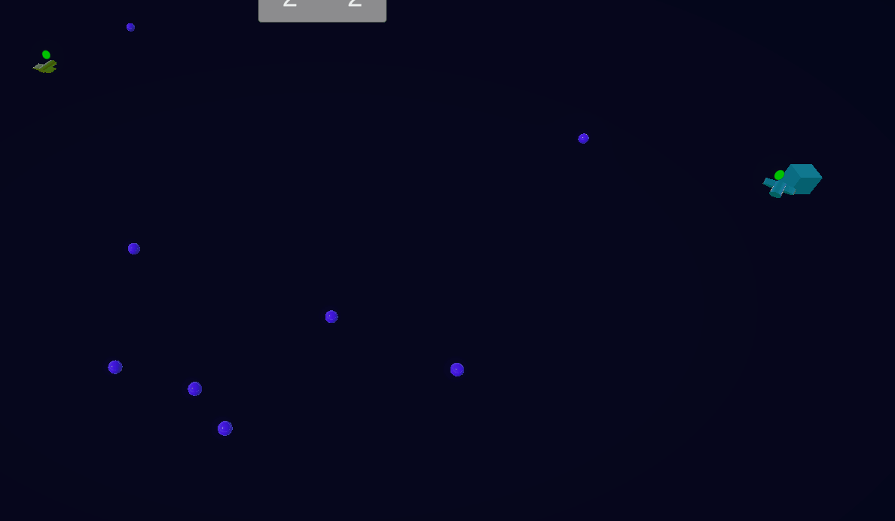

# Drone Resource Collector Simulation

3D симулятор сбора ресурсов дронами с управляемыми параметрами и визуализацией

Дроны летают и собирают ресурсы, после чего возвращаются на базу, где выгружают их.
Ресурсы спавнятся случайно. В UI можно настроить скорость дронов, количество дронов, частоту спавна ресурсов, отображение пути дрона. 
Сверху есть счет ресурсов для каждой из баз. Так же над дронам есть значок, который отображает его статус.

Точка входа - Game.cs, инициализирует две базы, которые спавнят дронов и управляют ими. 
Так же запускает спавн ресурсов. Связь между логикой игры и UI осуществляется через медиатор.
Использованы ассеты - NavMash для навигации.
